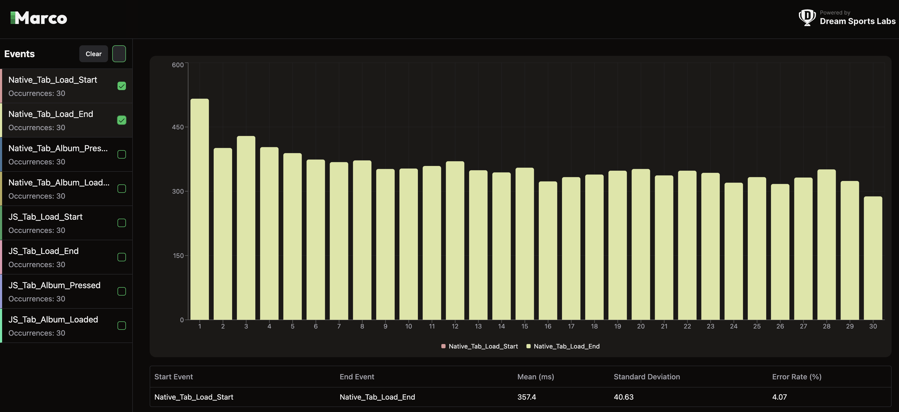
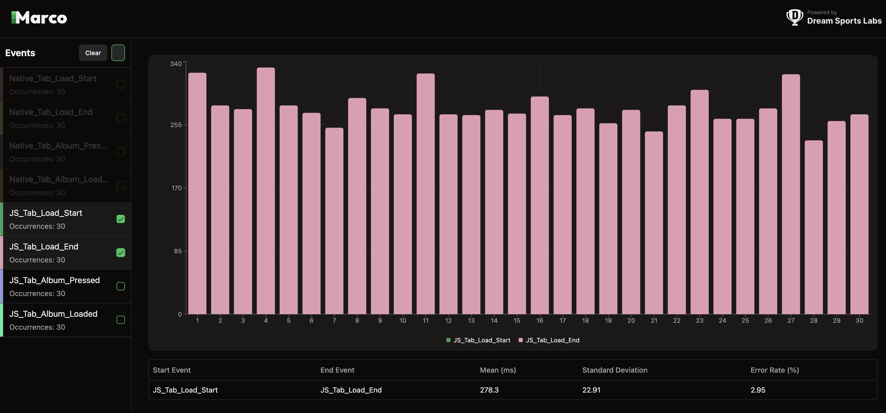
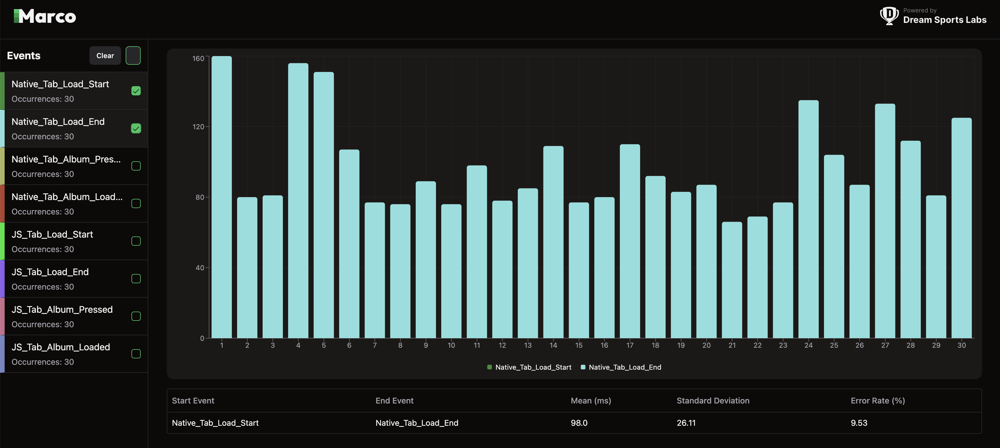
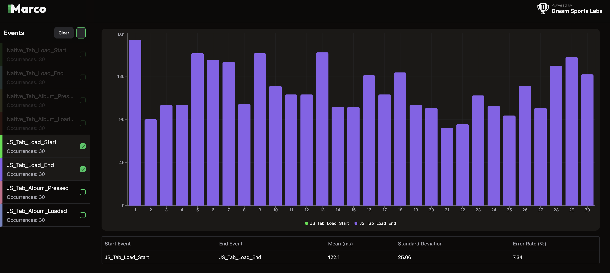
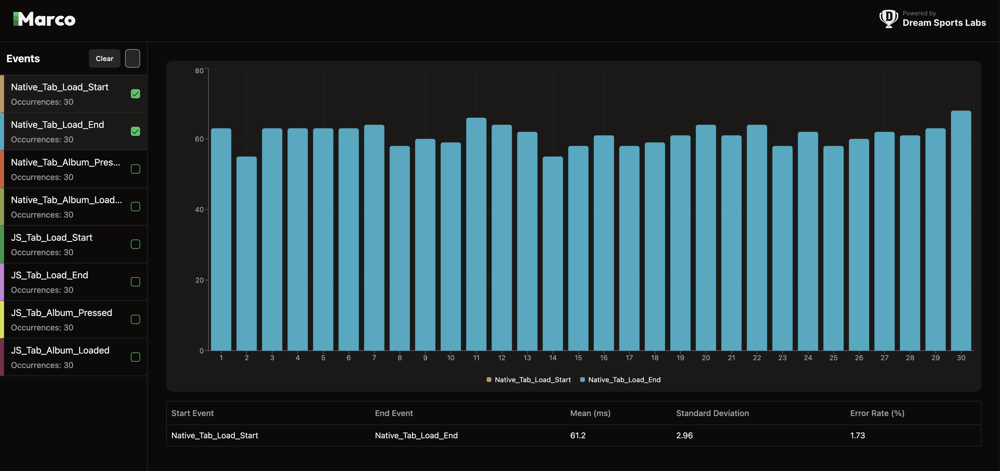
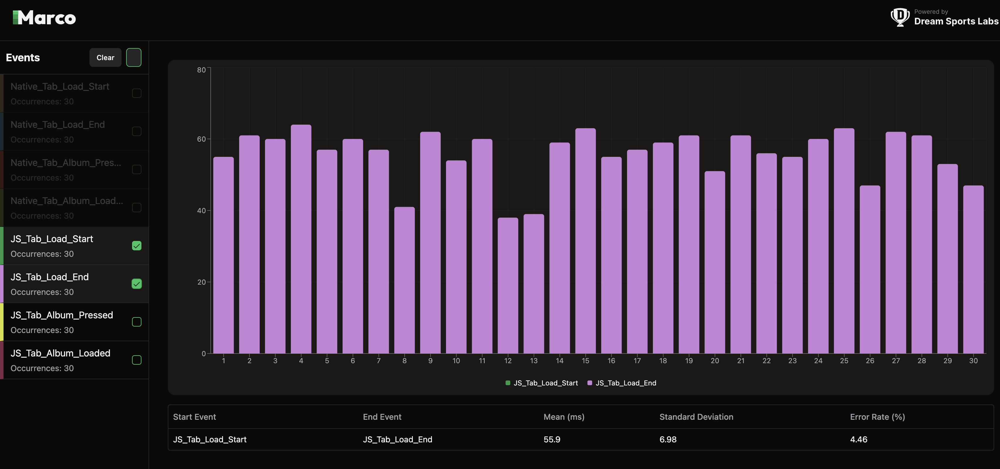
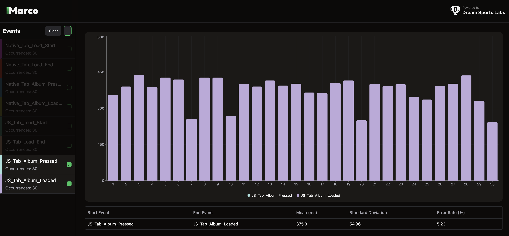
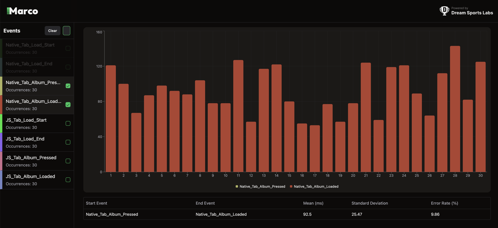
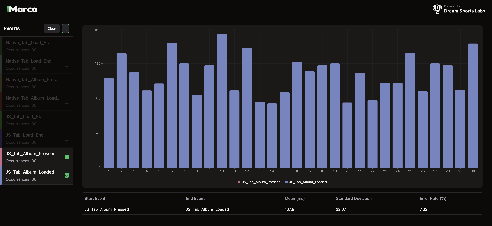
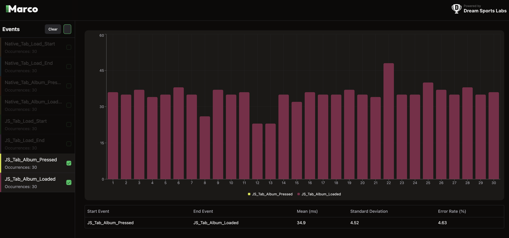

# RN BottomTab Benchmarks

This repository benchmarks [**Native Bottom Tabs**](https://github.com/callstackincubator/react-native-bottom-tabs) against [**JS Bottom Tabs**](https://reactnavigation.org/docs/bottom-tab-navigator/) based on performance metrics such as load time and tab switch time. The **Native Bottom Tab** library, developed by [okwasniewski](https://github.com/okwasniewski), serves as the foundation for the native tab implementation. All benchmarking is conducted using a **Native Stack** implementation.

## Benchmarking Metrics 📊
- **Load Time**: Time taken to load the initial screen when a bottom tab is opened.
- **Tab Switch Time**: Time taken to switch between tabs and display the next screen.

## About the Benchmarking Process 📝

We are using the [**Marco**](https://marco.dreamsportslabs.com/) tool to mark events and CLI tools provided by Marco to visualize the results.

<details><summary>Device details</summary>

    These benchmarks were conducted on different Android real devices:
    - Vivo Y15 (Low-end device)
        - OS: Android 12
        - RAM: 3 GB
    - OnePlus Nord 2T (High-end device)
        - OS: Android 14
        - RAM: 8 GB
    - iPhone 15 Pro 17.2
</details>

## Load Time ⌛

1. **Capture the Initial Event:**
   - The event is triggered when a button is clicked to open a bottom tab. (refer: [Native](https://github.com/dream-sports-labs/rn-tabs-benchmarks/blob/5acd34946b242e80180a2f4d1c981527990141c8/src/TabsBenchmark.tsx#L23) & [JS](https://github.com/dream-sports-labs/rn-tabs-benchmarks/blob/5acd34946b242e80180a2f4d1c981527990141c8/src/TabsBenchmark.tsx#L31))
   - The `timestamp` is extracted from the `Pressable.onPress` event object.
   - The `timestamp` and a marker name are passed to the native module `PerformanceTracker.track()` to log the start time.

2. **Track Screen Rendering:**
   - The load time completes when the initial screen content is fully painted and visible.
   - We wrapped the **Article Screen** with the [**PerformanceTracker**](https://marco.dreamsportslabs.com/api/tracking-screen/) API from the **Marco** library.
   - This accurately captures the **onDraw** event, indicating when the screen is fully rendered.
   - Code [reference](https://github.com/dream-sports-labs/rn-tabs-benchmarks/blob/5acd34946b242e80180a2f4d1c981527990141c8/src/Screens/Article.tsx#L51)

## Tab Switch Time 🔄

1. **Capture the Tab Press Event:**
   - The event is captured when a tab is pressed. (refer: [JS](https://github.com/dream-sports-labs/rn-tabs-benchmarks/blob/5acd34946b242e80180a2f4d1c981527990141c8/src/JSBottomTab.tsx#L30) & [Native](https://github.com/dream-sports-labs/rn-tabs-benchmarks/blob/5acd34946b242e80180a2f4d1c981527990141c8/src/NativeBottomTab.tsx#L31))
   - The `timestamp` is obtained from listeners attached to the `tabPress` event at the screen level.
   - This `timestamp`, along with a marker name, is sent to `PerformanceTracker.track()` to log the start of the tab switch action.

2. **Track New Screen Rendering:**
   - The tab switch time completes when the new screen content is fully rendered and visible.
   - We wrapped the **Album Screen** with the [**PerformanceTracker**](https://marco.dreamsportslabs.com/api/tracking-screen/) API from the **Marco** library.
   - This accurately captures the **onDraw** event, marking the end of the tab switch process and the benchmark.
   - Code [reference](https://github.com/dream-sports-labs/rn-tabs-benchmarks/blob/5acd34946b242e80180a2f4d1c981527990141c8/src/Screens/Albums.tsx#L57)


## Results

### Load Time Comparison (Native vs JS)

| Device        | Native Bottom Tabs | JS Bottom Tabs |
|--------------|------------------|------------------|
| Vivo (low-end) | **357 ms** | **278 ms** |
| OnePlus (high-end) | **98 ms** | **122 ms** |
| iPhone | **61 ms** | **55 ms** |

### Marco reports for Vivo





<details ><summary>Click to View Oneplus Load Time Reports</summary>



</details>

<details ><summary>Click to View iPhone Load Time Reports</summary>



</details>

### Tab Switch Time Comparison (Native vs JS)

| Device        | Native Bottom Tabs | JS Bottom Tabs |
|--------------|------------------|------------------|
| Vivo (low-end) | **418 ms** | **375 ms** |
| Oneplus (high-end)| **92 ms** | **107 ms** |
| iPhone| **28 ms** | **34 ms** |

### Marco reports for Vivo




<details > <summary>Click to View Oneplus Tab Switch Reports</summary>


 </details>

<details > <summary>Click to View iPhone Tab Switch Reports</summary>


 </details>

> The Marco snapshots are stored inside: `reports/<platform>/<device>/log.json`.

## Summary 📌
### Load Time:

- JS Bottom Tabs were **faster on low-end** devices (278ms vs. 357ms).
- Native Bottom Tabs were **faster on high-end** devices (98ms vs. 122ms).
- Native Bottom Tabs were **slower on iOS** devices.

### Tab Switch Time:

- JS Bottom Tabs had a slight edge on low-end devices (375ms vs. 418ms).
- Native Bottom Tabs were faster on high-end devices (92ms vs. 107ms).
- Native Bottom Tabs were **faster on iOS** devices.

<details><summary>How to Run the Benchmarks 🛠️</summary>

### Prerequisites

1. [React Native Environment Setup](https://reactnative.dev/docs/next/environment-setup)
2. [Maestro Setup](https://maestro.mobile.dev/)
   - To check if Maestro is installed on your system, run command:
   ```sh
   maestro --version
   ```

### Setup

```sh
git clone git@github.com:dream-sports-labs/rn-tabs-benchmarks.git
cd rn-tabs-benchmarks
yarn install
```

### Create Release Build

```sh
yarn android --mode=Release
```

### Run the Benchmarks

```sh
yarn get:numbers:android <iteration_count>
```

This will run the test as described in `src/scripts/automation/test.yaml`.

### Generate and Visualize Report

A configuration file, `marco.config.js`, contains default paths to store reports. We can configure them based on our needs.

```sh
yarn marco generate --platform android
```

```sh
yarn marco visualize --platform android
```

This will open up a dashboard where we can select events to analyse data.

> **Ensure the correct `dataDir` path is set in `marco.config.js`**.

</details>

👉 Checkout [Marco](https://www.npmjs.com/package/@d11/marco) to benchmark more such scenarios.
